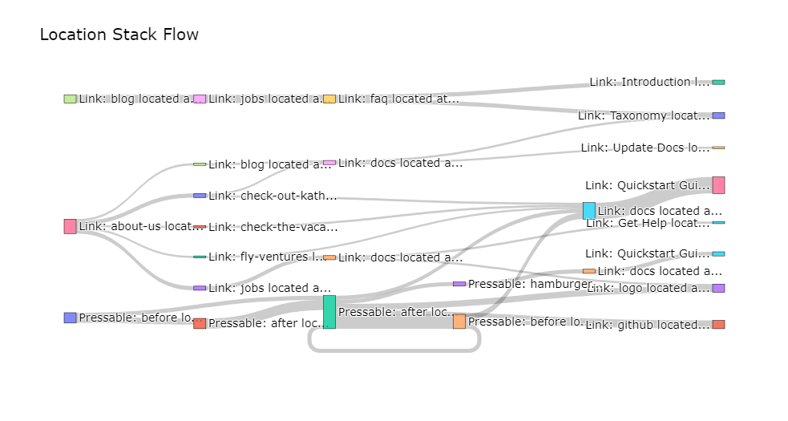

.. _funnel_discovery:

.. frontmatterposition:: 6

.. currentmodule:: bach

.. testsetup:: funnel-discovery
	:skipif: engine is None

	df = modelhub.get_objectiv_dataframe(
			db_url=DB_URL,
			start_date='2022-02-01',
			end_date='2022-06-30',
			table_name='data')
	pd.set_option('display.max_colwidth', 93)

================
Funnel Discovery
================

This example notebook shows how to use the 'Funnel Discovery' model on your data collected with Objectiv. 
It's also available as a `full Jupyter notebook 
<https://github.com/objectiv/objectiv-analytics/blob/main/notebooks/funnel-discovery.ipynb>`_
to run on your own data (see how to :doc:`get started in your notebook <../get-started-in-your-notebook>`), 
or you can instead `run the Demo </docs/home/quickstart-guide/>`_ to quickly try it out. The dataset used 
here is the same as in the Demo.

Get started
-----------
We first have to instantiate the model hub and an Objectiv DataFrame object.

.. doctest:: funnel-discovery
	:skipif: engine is None

	>>> # instantiate the model hub, and set the default time aggregation to daily
	>>> from modelhub import ModelHub
	>>> modelhub = ModelHub(time_aggregation='%Y-%m-%d')
	>>> # get an Objectiv DataFrame within a defined timeframe
	>>> df = modelhub.get_objectiv_dataframe(db_url=DB_URL, start_date='2022-02-01', end_date='2022-06-30')

.. doctest:: funnel-discovery
	:skipif: engine is None

	>>> # add specific contexts to the data as columns
	>>> df['application'] = df.global_contexts.gc.application
	>>> df['feature_nice_name'] = df.location_stack.ls.nice_name

.. doctest:: funnel-discovery
	:skipif: engine is None

	>>> # select which event type to use for further analysis - PressEvents to focus on what users directly interact with
	>>> df = df[df['event_type'] == 'PressEvent']

.. admonition:: Reference
	:class: api-reference

	* :doc:`modelhub.ModelHub.get_objectiv_dataframe <../open-model-hub/api-reference/ModelHub/modelhub.ModelHub.get_objectiv_dataframe>`
	* :doc:`modelhub.SeriesGlobalContexts.gc <../open-model-hub/api-reference/SeriesGlobalContexts/modelhub.SeriesGlobalContexts.gc>`
	* :doc:`modelhub.SeriesLocationStack.ls <../open-model-hub/api-reference/SeriesLocationStack/modelhub.SeriesLocationStack.ls>`

First: define what is conversion
--------------------------------
As a prerequisite for Funnel Discovery, define the events you see as conversion.

In this example we will view someone as converted when they go on to read the documentation from our website, 
but you can 
:doc:`use any event <../open-model-hub/api-reference/ModelHub/modelhub.ModelHub.add_conversion_event>`

.. doctest:: funnel-discovery
	:skipif: engine is None

	>>> # define which data to use as conversion events; in this example, anyone who goes on to read the documentation
	>>> df['is_conversion_event'] = False
	>>> df.loc[df['application'] == 'objectiv-docs', 'is_conversion_event'] = True

Out of curiosity, let's see which features are used by users that converted, sorted by their conversion impact.

.. doctest:: funnel-discovery
	:skipif: engine is None

	>>> # calculate the percentage of converted users per feature: (converted users per feature) / (total users converted)
	>>> total_converted_users = df[df['is_conversion_event']]['user_id'].unique().count().value
	>>> top_conversion_locations = modelhub.agg.unique_users(df[df['is_conversion_event']], groupby='feature_nice_name')
	>>> top_conversion_locations = (top_conversion_locations / total_converted_users) * 100
	>>> 
	>>> # show the results, with .to_frame() for nicer formatting
	>>> top_conversion_locations = top_conversion_locations.to_frame().rename(columns={'unique_users': 'converted_users_percentage'})
	>>> top_conversion_locations.sort_values(by='converted_users_percentage', ascending=False).head()
	                                                                                   converted_users_percentage
	feature_nice_name
	Link: Quickstart Guide located at Root Location: home => Navigation: docs-sidebar                   15.946844
	Link: logo located at Root Location: home => Navigation: navbar-top                                 10.797342
	Link: Tracking located at Root Location: home => Navigation: navbar-top                             10.631229
	Link: Taxonomy located at Root Location: modeling => Navigation: navbar-top                         10.299003
	Link: Modeling located at Root Location: tracking => Navigation: navbar-top                         9.966777

.. admonition:: Reference
	:class: api-reference

	* :doc:`bach.Series.unique <../bach/api-reference/Series/bach.Series.unique>`
	* :doc:`bach.DataFrame.count <../bach/api-reference/DataFrame/bach.DataFrame.count>`
	* :doc:`modelhub.Aggregate.unique_users <../open-model-hub/models/aggregation/modelhub.Aggregate.unique_users>`
	* :doc:`bach.Series.to_frame <../bach/api-reference/Series/bach.Series.to_frame>`
	* :doc:`bach.DataFrame.rename <../bach/api-reference/DataFrame/bach.DataFrame.rename>`
	* :doc:`bach.DataFrame.sort_values <../bach/api-reference/DataFrame/bach.DataFrame.sort_values>`
	* :doc:`bach.DataFrame.head <../bach/api-reference/DataFrame/bach.DataFrame.head>`

See step sequences per user
---------------------------
TODO

.. doctest:: funnel-discovery
	:skipif: engine is None

	>>> # define which data to use as conversion events; in this example, anyone who goes on to read the documentation
	>>> df['is_conversion_event'] = False
	>>> df.loc[df['application'] == 'objectiv-docs', 'is_conversion_event'] = True

TODO

See top step sequences for all users
------------------------------------
TODO

.. doctest:: funnel-discovery
	:skipif: engine is None

	>>> # instantiate the FunnelDiscovery model from the open model hub
	>>> funnel = modelhub.get_funnel_discovery()
	>>> # set the maximum n steps
	>>> max_steps = 4

TODO

See step sequences that lead to conversion
------------------------------------------
Now let's find the sequences that actually lead to conversion.

First, see which step resulted in conversion to the dataframe, which will be `NaN` for sequences that did not 
convert.

.. doctest:: funnel-discovery
	:skipif: engine is None

	>>> # add which step resulted in conversion to the dataframe, with the `add_conversion_step_column` param
	>>> df_first_conversion_step = funnel.get_navigation_paths(df, steps=max_steps, by='user_id', add_conversion_step_column=True)
	>>> df_first_conversion_step.head(10)
	                                                                                                             location_stack_step_1                                                                         location_stack_step_2                                                                         location_stack_step_3                                                                         location_stack_step_4  _first_conversion_step_number
	user_id                                                                                                                                                                                                                                                                                                                        
	0000bb2f-66e9-4e48-8e2f-7d0a82446ef4                       Link: about-us located at Root Location: home => Navigation: navbar-top                          Link: logo located at Root Location: about => Navigation: navbar-top                                                                                          None                                                                                          None                            NaN
	0000bb2f-66e9-4e48-8e2f-7d0a82446ef4                          Link: logo located at Root Location: about => Navigation: navbar-top                                                                                          None                                                                                          None                                                                                          None                            NaN
	00529837-d672-4747-9b87-fd09f2919326                           Link: blog located at Root Location: home => Navigation: navbar-top  Pressable: after located at Root Location: home => Content: capture-data => Content: data...                        Link: spin-up-the-demo located at Root Location: home => Content: hero                           Link: blog located at Root Location: home => Navigation: navbar-top                            NaN
	00529837-d672-4747-9b87-fd09f2919326  Pressable: after located at Root Location: home => Content: capture-data => Content: data...                        Link: spin-up-the-demo located at Root Location: home => Content: hero                           Link: blog located at Root Location: home => Navigation: navbar-top                           Link: docs located at Root Location: blog => Navigation: navbar-top                            NaN
	00529837-d672-4747-9b87-fd09f2919326                        Link: spin-up-the-demo located at Root Location: home => Content: hero                           Link: blog located at Root Location: home => Navigation: navbar-top                           Link: docs located at Root Location: blog => Navigation: navbar-top  Link: bach-and-sklearn located at Root Location: modeling => Navigation: docs-sidebar => ...                            4.0
	00529837-d672-4747-9b87-fd09f2919326                           Link: blog located at Root Location: home => Navigation: navbar-top                           Link: docs located at Root Location: blog => Navigation: navbar-top  Link: bach-and-sklearn located at Root Location: modeling => Navigation: docs-sidebar => ...  Link: basic-product-analytics located at Root Location: modeling => Navigation: docs-side...                            3.0
	00529837-d672-4747-9b87-fd09f2919326                           Link: docs located at Root Location: blog => Navigation: navbar-top  Link: bach-and-sklearn located at Root Location: modeling => Navigation: docs-sidebar => ...  Link: basic-product-analytics located at Root Location: modeling => Navigation: docs-side...                                                                                          None                            2.0
	00529837-d672-4747-9b87-fd09f2919326  Link: bach-and-sklearn located at Root Location: modeling => Navigation: docs-sidebar => ...  Link: basic-product-analytics located at Root Location: modeling => Navigation: docs-side...                                                                                          None                                                                                          None                            1.0
	00529837-d672-4747-9b87-fd09f2919326  Link: basic-product-analytics located at Root Location: modeling => Navigation: docs-side...                                                                                          None                                                                                          None                                                                                          None                            1.0
	005aa19c-7e80-4960-928c-a0853355ee5f  Link: check-out-thijs-obj-on-github located at Root Location: about => Content: core-team...                          Link: jobs located at Root Location: about => Navigation: navbar-top                                                                                          None                                                                                          None                            NaN

To filter down to all sequences that have actually converted, use the `only_converted_paths` parameter.

.. doctest:: funnel-discovery
	:skipif: engine is None

	>>> # filter down to all sequences that have actually converted with the `only_converted_paths` param
	>>> df_steps_till_conversion = funnel.get_navigation_paths(df, steps=max_steps, by='user_id', add_conversion_step_column=True, only_converted_paths=True)
	>>> df_steps_till_conversion.head(5)  
	                                                                  location_stack_step_1                              location_stack_step_2                              location_stack_step_3                              location_stack_step_4  _first_conversion_step_number
	user_id          
	00529837-d672-4747-9b87-fd09f2919326  Link: spin-up-the-demo located at Root Locatio...  Link: blog located at Root Location: home => N...  Link: docs located at Root Location: blog => N...  Link: bach-and-sklearn located at Root Locatio...                              4
	00529837-d672-4747-9b87-fd09f2919326  Link: blog located at Root Location: home => N...  Link: docs located at Root Location: blog => N...  Link: bach-and-sklearn located at Root Locatio...                                               None                              3
	00529837-d672-4747-9b87-fd09f2919326  Link: docs located at Root Location: blog => N...  Link: bach-and-sklearn located at Root Locatio...                                               None                                               None                              2
	007f5fd7-7535-434e-aa3e-3d52f06d63ce  Link: docs located at Root Location: home => N...  Link: Modeling located at Root Location: home ...                                               None                                               None                              2
	007f5fd7-7535-434e-aa3e-3d52f06d63ce  Link: docs located at Root Location: home => N...  Link: Modeling located at Root Location: home ...                                               None                                               None                              2

We can use this to for instance see which sequences converted on the 4th step.

.. doctest:: funnel-discovery
	:skipif: engine is None

	>>> # filter down to sequences that converted on the 4th step
	>>> condition_convert_on_step_4 = df_steps_till_conversion['_first_conversion_step_number'] == 4
	>>> df_steps_till_conversion[condition_convert_on_step_4].head()
	                                                                  location_stack_step_1                              location_stack_step_2                              location_stack_step_3                              location_stack_step_4  _first_conversion_step_number
	user_id          
	00529837-d672-4747-9b87-fd09f2919326  Link: spin-up-the-demo located at Root Locatio...  Link: blog located at Root Location: home => N...  Link: docs located at Root Location: blog => N...  Link: bach-and-sklearn located at Root Locatio...                              4
	01891784-6333-40f1-8be6-739f3adfdb97  Link: about-us located at Root Location: home ...  Pressable: hamburger located at Root Location:...  Link: faq located at Root Location: home => Na...  Pressable: navbar-toggle located at Root Locat...                              4
	02f197f4-90d1-4374-b8a5-89e2e91310d7  Pressable: after located at Root Location: hom...  Pressable: before located at Root Location: ho...  Pressable: after located at Root Location: hom...  Link: logo located at Root Location: modeling ...                              4
	05bd4058-b7df-4476-8174-dcf0be107b5c  Link: blog located at Root Location: home => N...  Link: jobs located at Root Location: blog => N...  Link: faq located at Root Location: jobs => Na...  Link: Objectiv.io located at Root Location: ho...                              4
	0605440c-1eba-479a-9000-8294576199aa  Link: check-out-jansenbob-on-github located at...  Link: blog located at Root Location: about => ...  Link: read-more located at Root Location: blog...  Link: MediaEvent located at Root Location: tax...                              4

Visualize these sequences in a Sankey diagram
~~~~~~~~~~~~~~~~~~~~~~~~~~~~~~~~~~~~~~~~~~~~~
We can use a Sankey diagram to visualize these customer journeys that lead to conversion (or drop-off). This 
helps you to select which sequences are most interesting to analyze further.

Let's plot it for the example above, where we filtered down to the sequences that converted on the 4th step. 
The width of each link represents the amount of times that flow was used, and you can hover over each link to 
see the source and target node.

.. do not test the code block below, as it generates a Sankey diagram that tries to display, but doesn't find a TTY 
	
.. code-block:: jupyter-notebook
	
	>>> # plot the Sankey diagram using the top 15 examples via the `n_top_examples` param
	>>> funnel.plot_sankey_diagram(df_steps_till_conversion[condition_convert_on_step_4], n_top_examples=15)

Showing 15 examples out of 265

.. admonition:: Reference
	:class: api-reference

	* TODO: modelhub.models.funnel_discovery.get_navigation_paths
	* TODO: modelhub.models.funnel_discovery.plot_sankey_diagram
	* :doc:`modelhub.models.funnel_discovery.get_navigation_paths <../bach/api-reference/DataFrame/bach.DataFrame.head>`
